# 一、indexedDB简单介绍

### IndexedDB是一个事务型数据库系统,是一个基于JavaScript的面向对象的数据库,可以存储结构化克隆算法支持的任何对象

# 二、对象列表

- 数据库: indexedDB
- 数据库开启请求对象: IDBOpenDBRequest
- 数据库接口: IDBDatabase
- 数据库中的对象仓库: IDBObjectStore
- 数据库索引: IDBIndex
- 事务对象: IDBTransation
- 数据库操作请求对象: IDBRequest
- 游标对象: IDBCursor

# 三、基本使用指南

## 1、建立/打开数据库

- 先学会删库


- 调用API输入数据库名称(和版本号)

``````javascript
const openRequest = window.indexedDB.open("indexedDB", 1)
``````

已存在则打开数据库，不存在则创建数据库，该方法返回一个`IDBOpenDbRequest`对象

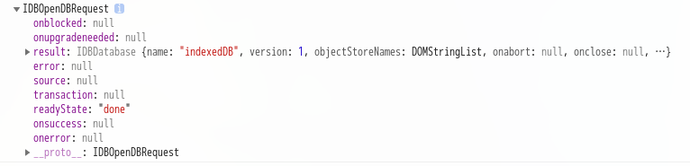

>当前流程

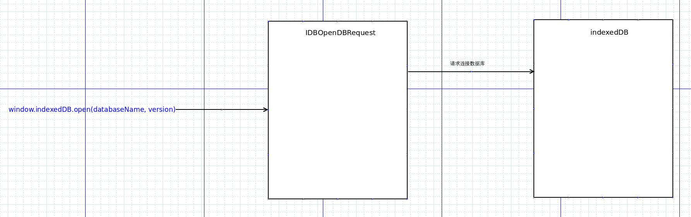

接下来数据库会返回响应，我们需要处理打开数据库操作的结果，因此需要在`IDBOpenDBRequest`上注册回调函数

``````javascript
const openRequest = window.indexedDB.open("indexedDB", 1)

//错误回调
openRequest.addEventListener("error", function(event) {
  console.log(event)
  console.log("数据库打开错误!")
})

//成功回调
openRequest.addEventListener("success", function(event) {
  console.log(event)
  console.log("数据库打开成功！")
})

//建立/升级回调
openRequest.addEventListener("upgradeneeded", function(event) {
  console.log(event)
  console.log("建立/升级数据库!")
})
``````

>当前流程

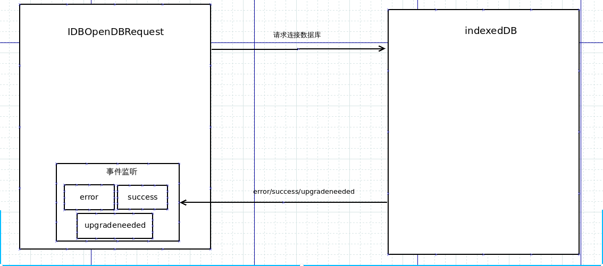

新建/升级数据库会先执行`upgradeneeded`的回调再执行`success`的回调

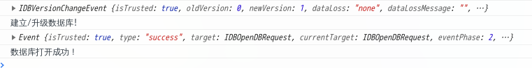

在回调的`event.target.result`中可以获得我们需要的数据库接口`IDBDatabase`，有了这个接口就可以对数据库进行操作了

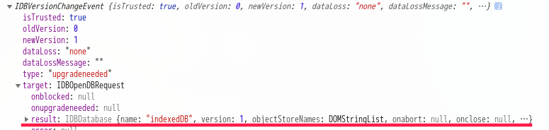

- 根据要储存的数据建立对象仓库和索引

``````json
{
    "id": 1,
    "name": "X某"
}
``````

``````javascript
//建立/升级回调
openRequest.addEventListener("upgradeneeded", function(event) {
  //获取接口
  IDBDatabase = event.target.result

  //建立对象仓库，设置主键为'id', 获取对象仓库
  const objectStore = IDBDatabase.createObjectStore('person', { keyPath: 'id' })

  //建立索引，设置索引名称为'indexName', 索引对应属性'name', 属性是否不重复
  objectStore.createIndex('indexName', 'name', { unique: false })

  console.log("建立/升级数据库!")
})
``````

现在你获取到了一个接口，该接口指向一个拥有一个`person`对象仓库并且仓库里有一个`indexName`索引的数据库

>当前流程

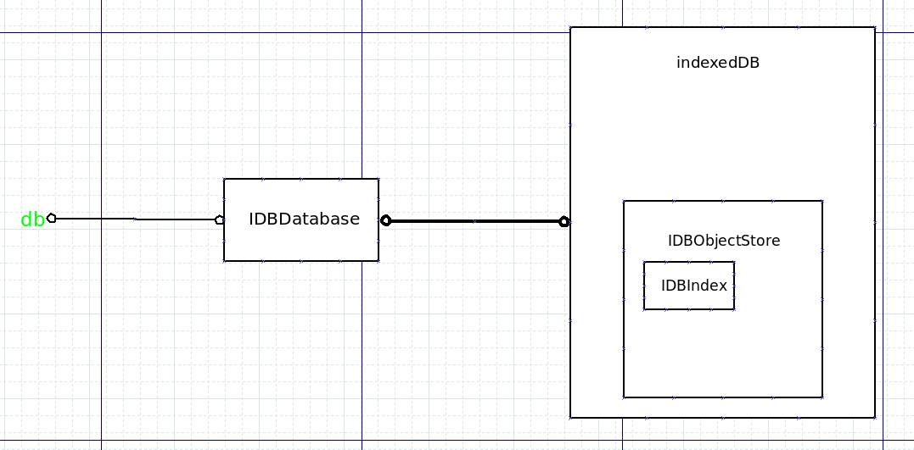

## 2、向数据库添加数据

- indexedDB是一个事务型数据库系统，因此对数据进行操作要建立事务

``````javascript
function addData(data) {
  //在数据库中建立事务，并返回事务对象, 设置事务涉及的对象仓库, 以及事务的操作模式
  const IDBTransaction = IDBDatabase.transaction(['person'], 'readwrite')

  //添加回调
  IDBTransaction.addEventListener("error", function(event) {
    console.log(event)
    console.log("数据添加事务错误！")
  })
  IDBTransaction.addEventListener("complete", function(event) {
    console.log(event)
    console.log("事务结束!")
  })
}

addData({ id: 1, name: 'X某' })
``````

>当前流程

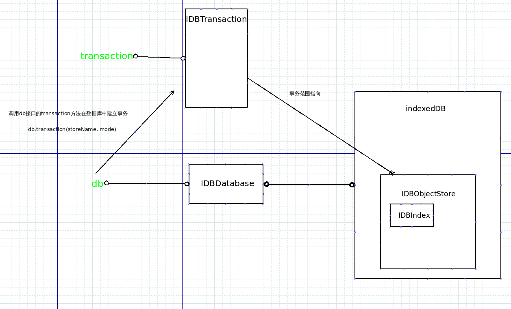

- 调用事务对象的API返回要操作的`IDBObjectStore`实例（同一个事务返回相同实例，不同事务返回不同实例）

``````javascript
const IDBObjectStore = IDBTransaction.objectStore('person')
``````

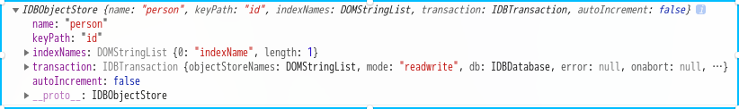

>当前流程

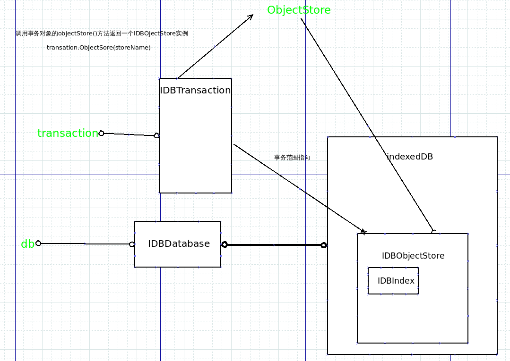

- 调用`IDBObjectStore`对象的API添加数据, 对于数据的操作一般都会返回一个`IDBRequest`对象, 为该对象添加回调判断操作是否成功

``````javascript
function addData(data) {
  //在数据库中建立事务，并返回事务对象, 设置事务涉及的对象仓库, 以及事务的操作模式
  const IDBTransaction = IDBDatabase.transaction(['person'], 'readwrite')

  //获取对象仓库实例
  const IDBObjectStore = IDBTransaction.objectStore('person')

  //获得请求对象
  const IDBRequest = IDBObjectStore.add(data)

  //添加回调
  IDBRequest.addEventListener("error", function(event) {
    console.log(event)
    console.log("添加数据失败!")
  })
  IDBRequest.addEventListener("success", function(event) {
    console.log(event)
    console.log("添加数据成功！")
  })

  //添加回调
  IDBTransaction.addEventListener("error", function(event) {
    console.log(event)
    console.log("数据添加事务错误！")
  })
  IDBTransaction.addEventListener("complete", function(event) {
    console.log(event)
    console.log("事务结束!")
  })
}
``````

>当前流程

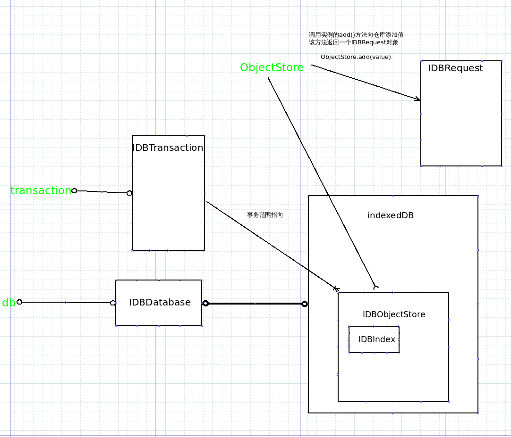

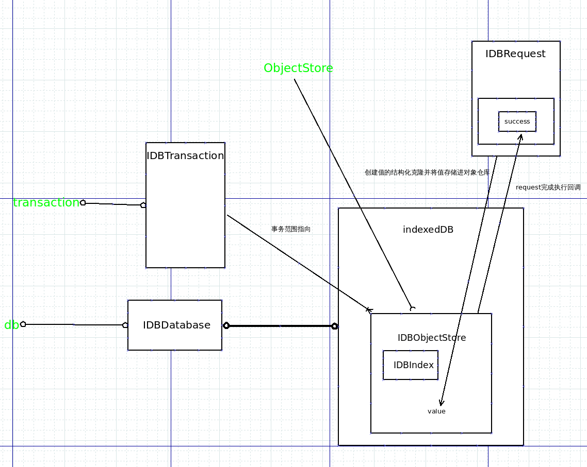

结束后就可以看到数据库中的数据了

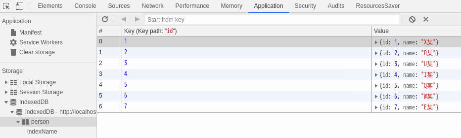

## 3、遍历数据仓库中的数据

- 同上，不过是使用了仓库对象的不同API，但是遍历时会产生一个游标指向当前遍历数据，需要手动继续向下便利


>当前流程

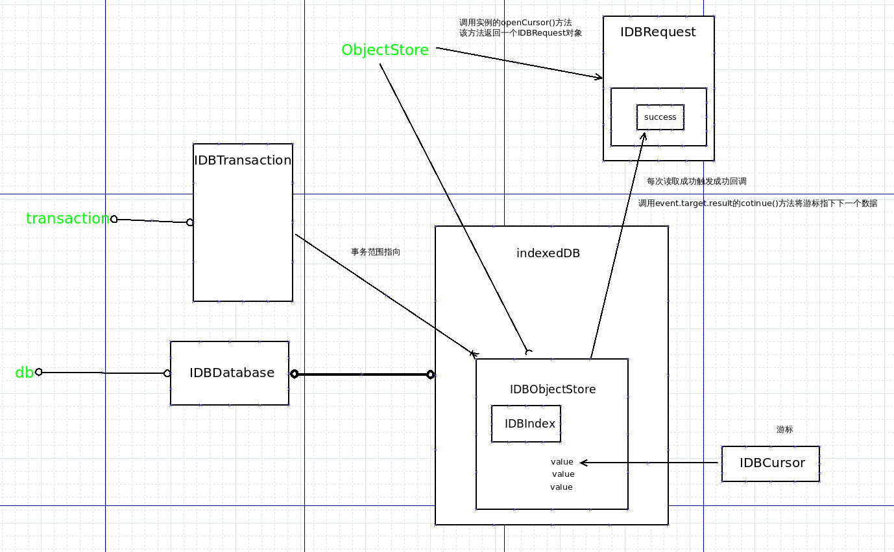

``````javascript
function ergodic(store) {
  //在数据库中建立事务，并返回事务对象, 设置事务涉及的对象仓库, 以及事务的操作模式
  const IDBTransaction = IDBDatabase.transaction(store, 'readonly')

  //获取对象仓库实例
  const IDBObjectStore = IDBTransaction.objectStore(store)

  const IDBRequest = IDBObjectStore.openCursor()

  //添加回调
  IDBRequest.addEventListener("error", function(event) {
    console.log("遍历数据失败!")
  })
  IDBRequest.addEventListener("success", function(event) {
    const cursor = event.target.result
    if(cursor) {
      console.log(cursor)
      cursor.continue()
    } else (
      console.log("遍历完成!")
    )
  })

  //添加回调
  IDBTransaction.addEventListener("error", function(event) {
    console.log("数据添加事务错误！")
  })
}

ergodic("person")
``````

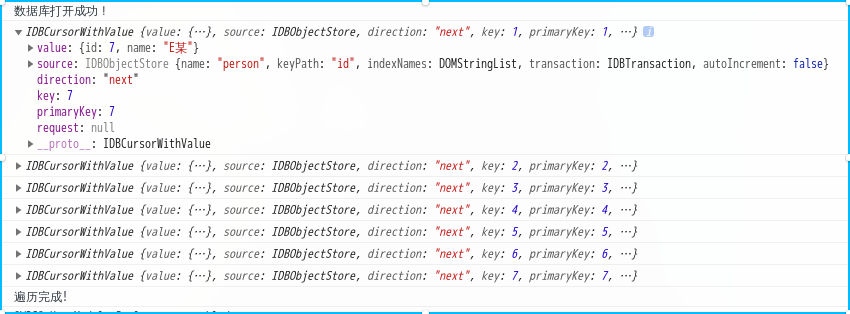

## 4、索引的使用

>如果不使用索引就只能搜索主键

- 用仓库对象API打开仓库内的索引，索引具有与仓库对象相同的操作数据的API

``````javascript
function getDataByName(store, name) {
  //在数据库中建立事务，并返回事务对象, 设置事务涉及的对象仓库, 以及事务的操作模式
  const IDBTransaction = IDBDatabase.transaction(store, 'readonly')

  //获取对象仓库实例
  const IDBObjectStore = IDBTransaction.objectStore(store)

  const IDBIndex = IDBObjectStore.index('indexName')

  const IDBRequest = IDBIndex.get(name)

  //添加回调
  IDBRequest.addEventListener("error", function(event) {
    console.log("获取数据失败!")
  })
  IDBRequest.addEventListener("success", function(event) {
    console.log(event.target)
    console.log("获取数据成功！")
  })

  //添加回调
  IDBTransaction.addEventListener("error", function(event) {
    console.log("数据获取事务错误！")
  })
}

getDataByName('person', 'E某')
``````

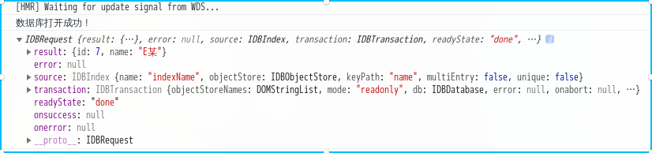


## 5、结束

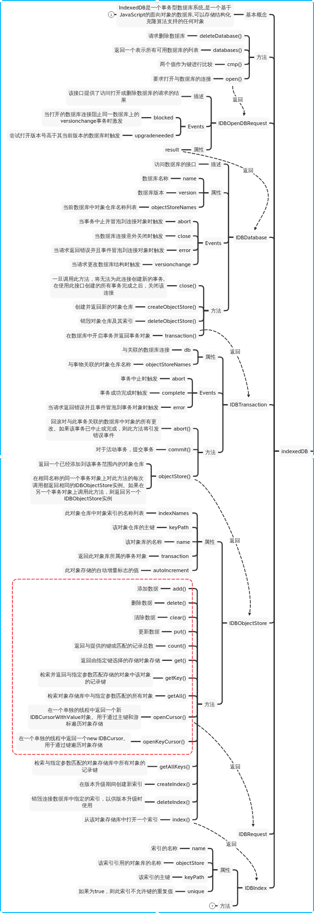

<span style="display: inline-block; width: 200px; height: 100px; border-radius: 50%; font-size: 24px; animation: link 1s alternate infinite; ">
  <a href="https://developer.mozilla.org/en-US/docs/Web/API/IndexedDB_API" style="display: inline-block; line-height: 100px;">
    <mark>奇怪的</mark>详细API
  </a>
</span>

<style>
@keyframes link {

0% { transform: rotate(0deg) translate( 0, 0 ) }

50% { transform: rotate(5deg) translate( 400px, 0 ) }

100% { transform: rotate(0deg) translate( 800px, 0 ) }
}
</style>
