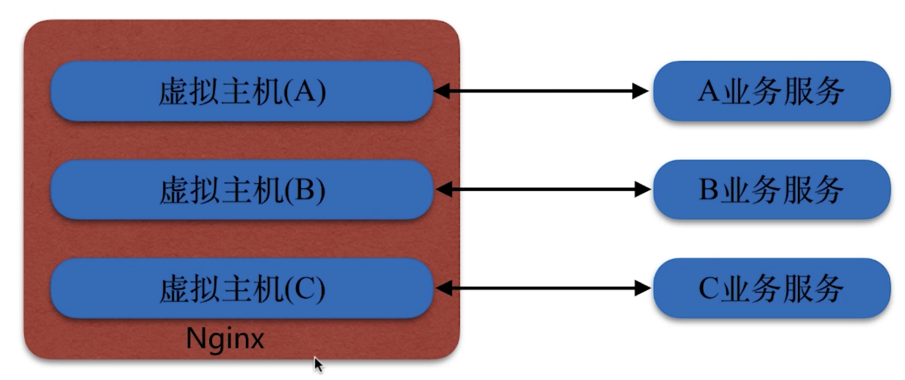
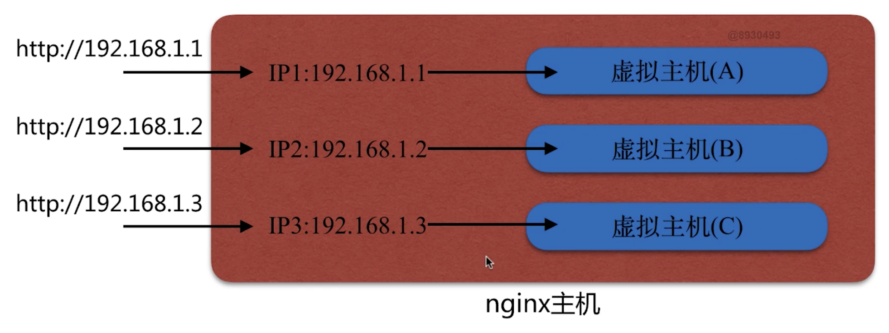
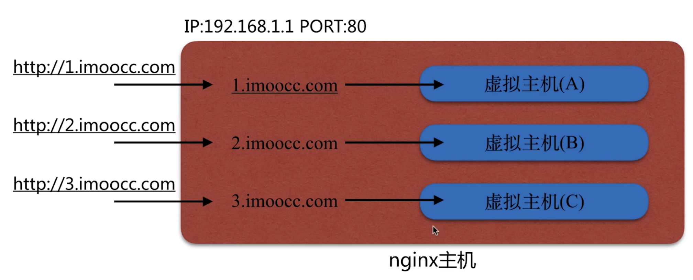

# Nginx 的中间件架构

> `nginx -h` 查看帮助

## 中间件

- 代理 `应用 - 应用` 或 `应用 - 操作系统` 之间的请求(http代理服务)

- 缓存服务

## Nginx

- Nginx是一个开源且高性能、可靠的HTTP中间件、代理服务

- 采用IO多路复用epoll模型

- CPU亲和

  - CPU核心和Nginx工作进程绑定方式

  - 把每个worker进程固定在一个cpu上执行

  - 减少切换cpu的cache miss，获得更好的性能

- sendfile

  - 静态资源请求: File -> 内核空间 -> 用户空间 -> Socket

  - Nginx处理静态资源: File -> 内核空间 -> Socket

## epoll模型

- Linux操作系统内核模块，处理IO复用的内核模型(实现IO复用)

- 解决 `SELECT` 模型对于文件句柄FD打开限制

- 采用 `callback` 函数回调机制优化模型效率

## 安装目录(CentOS)

| 路径 | 类型 | 作用 |
| :---- | :---- | :---- |
| /etc/logrotate.d/nginx | 配置文件 | Nginx日志转轮，用于logrotate服务的日志切割 |
| /etc/nginx<br>/etc/nginx/nginx.conf<br>/etc/nginx/conf.d<br>/etc/nginx/conf.d/default.conf | 目录、配置文件 | Nginx主配置文件 |
| /etc/nginx/fastcgi_params<br>/etc/nginx/uwsgi_params<br>/etc/nginx/scgi_params | 配置文件 | cgi配置相关，fastcgi配置 |
| /etc/nginx/koi-utf<br>/etc/nginx/koi-win<br>/etc/nginx/win-utf | 配置文件 | 编码转换映射转换文件 |
| /etc/nginx/mime.types | 配置文件 | 设置http协议的Content-Type与扩展名对应关系 |
| /usr/lib/systemd/system/nginx-debug.service<br>/usr/lib/systemd/system/nginx.service<br>/etc/sysconfig/nginx<br>/etc/sysconfig/nginx-debug | 配置文件 | 用于配置出系统守护进程管理器管理方式 |
| /usr/lib64/nginx/modules<br>/etc/nginx/modules | 目录 | Nginx模块目录 |
| /usr/sbin/nginx<br>/usr/sbin/nginx-debug | 命令 | Nginx服务的启动管理的终端命令 |
| /usr/share/doc/nginx-@版本<br>/usr/share/doc/nginx-@版本/COPYRIGHT<br>/usr/share/man/man8/nginx.8.gz | 文件、目录 | Nginx的手册和帮助文件 |
| /var/cache/nginx | 目录 | Nginx的缓存目录 |
| /var/log/nginx | 目录 | Nginx的日志目录 |

## 安装编译参数

| 编译选项 | 作用 |
| :---- | :---- |
| --prefix=/etc/nginx<br>--sbin-path=/usr/sbin/nginx<br>--modules-path=/usr/lib64/nginx/modules<br>--conf-path=/etc/nginx/nginx.conf<br>--error-log-path=/var/log/nginx/error.log<br>--http-log-path=/var/log/nginx/access.log<br>--pid-path=/var/run/nginx.pid<br>--lock-path=/var/run/nginx.lock | 安装目的目录或路径 |
| --http-client-body-temp-path=/var/cache/nginx/client_temp<br>--http-proxy-temp-path=/var/cache/nginx/proxy_temp<br>--http-fastcgi-temp-path=/var/cache/nginx/fastcgi_temp<br>--http-uwsgi-temp-path=/var/cache/nginx/uwsgi_temp<br>--http-scgi-temp-path=/var/cache/nginx/scgi_temp | 执行对应模块时，Nginx所保留的临时性文件 |
| --user=nginx<br>--group=nginx | 设定Nginx进程启动的用户和组用户 |
| --with-cc-opt=parameters | 设置额外的参数将被添加到CFLAGS变量 |
| --with-Id-opt=parameters | 设置附加的参数,链接系统库 |

## 默认配置语法

> `nginx -t` 可查看配置文件路径

```nginx
user nginx; # 设置nginx服务的系统使用用户
worker_processes auto; # 工作进程数
error_log /var/log/nginx/error.log; # nginx的错误日志
pid /run/nginx.pid; # nginx服务启动时的pid

events {
    worker_connections 1024; # 每个进程允许最大连接数
    # use 工作进程数
}

http {
    # http 服务
}
```

## 虚拟主机配置

> 在同一个 Nginx 上运行多套单独服务，这些服务是相互独立的
>
> 通过配置监听不同 ip、端口、host 实现多个虚拟主机



### 基于主机多IP的方式



- 在一台主机上绑定多个IP

  - 多网卡多IP

    

  - 单网卡多IP

    

    ```bash
    # mac
    sudo ifconfig en7 inet 10.1.102.97 netmask 255.0.0.0 alias # 设置别名 192.168.0.108
    sudo ifconfig en0 -alias 10.1.102.97 # 删除别名
    # centOS
    ip a # 查看
    ip a add 192.169.146/24 dev eth0 # 添加
    ```

- Nginx 文件配置

  - vserver1.conf

    ```nginx
    server {
      listen       ip1:port;
    }
    ```

  - vserver2.conf

    ```nginx
    server {
      listen       ip2:port;
    }
    ```

### 基于端口的配置方式


- Nginx 配置

  - vserver1.conf

    ```nginx
    server {
      listen       port1; # ip 不写表示监听本机所有ip地址
    }
    ```

  - vserver2.conf

    ```nginx
    server {
      listen       port2;
    }
    ```

### 基于多个 host 名称方式（多域名方式）

> 根据HTTP请求头中的Host字段定位虚拟主机



- Nginx 配置

  - vserver1.conf

    ```nginx
    server {
      server_name  1.rskmin.com;
    }
    ```

  - vserver2.conf

    ```nginx
    server {
      server_name  2.rskmin.com;
    }
    ```

## Nginx 日志

### 日志类型

- error_log
  - 记录各种错误日志
- access_log
  - 记录每次http的访问状态

### Log_format 配置

> 日志格式

- Syntax: log_format name [escape=default|json] string ...;

- Context: http
  - 只能配置在http模块下

## Nginx 变量

### HTTP 请求变量

- arg_PARAMETER

- http_HEADER

  Example: $http_user_agent

- send_http_HEADER

### 内置变量

http://nginx.org/en/docs/http/ngx_http_core_module.html#var_status

### 自定义变量

## Nginx 模块

> `nginx -V ` 中的 `--with`

### Nginx 官方模块

| 编译选项                        | 作用                 | 配置                                                         |
| ------------------------------- | -------------------- | ------------------------------------------------------------ |
| --with-http_stub_status_module  | Nginx 的客户端状态   | Syntax: sub_status<br>Default: --<br>Context: server, location |
| --with-http_random_index_module | 目录中选一个随机主页 | Syntax: random_index on \| off;<br>Default: random_index off;<br>Context: location |
| --with-http_sub_module          | HTTP内容替换         | Syntax: sub_filter string replacement;<br>Default: --<br>Context: http, server, location<br><hr><br>Syntax: sub_filter_last_modified on \| off;<br>Default: sub_filter_last_modified off;<br>Context: http, server, location<br><hr><br>Syntax: sub_filter_once on \| off;<br>Default: sub_filter_once on;<br>Context: http, server, location |
| --with-limit_conn_module        | 连接频率限制         | Syntax: limit_conn_zone key zone=name:size;<br>Defaut: --<br>Context: http<br><hr><br>Syntax: limit_conn zone number;<br>Default: --<br>Context: http, server ,location |
| --with-limit_req_module         | 请求频率限制         | Syntax: limit_req_zone key zone=name:size rate=rate;<br>Default: --<br>Context: http<br><hr><br>Syntax: limit_req zone=name [burst=number] [nodelay];<br>Default: --<br>Context: http, server, location |
| --with-http_access_module       | 基于IP的访问控制     | Syntax: allow address \| CIDR \| unix: \| all;<br>Default: --<br>Context: http, server, location, limit_except<br><hr><br>Syntax: deny address \| CIDR \| unix: \| all;<br>Defaylt: --<br>Context: http, server, loction, limit_except |
| --with-http_auth_basic_module   | 基于用户的信任登陆   | Syntax: auth_basic string \| off;<br>Default: auth_basic off;<br>Context: http, server, location, limit_except<br><hr><br>Syntax: auth_basic_user_file file;<br>Default: --<br>Context: http, server, location, limit_except |

### 第三方模块

## 应用

### 静态资源Web服务

#### CDN

- sendfile
  - Syntax: sendfile on | off;
  - Default: sendfile off;
  - Context: http, server, location, if in location

- tcp_nopush

  > sendfile 开启的情况下，提高网络包的传输效率
  >
  > 延迟发送，合并多个包的首部

  - Syntax: tcp_nopush on | off;
  - Default: tcp_nopush off;
  - Context: http, server, location

- tcp_nodelay

  > tpc 包及时发送，适用于实时性需求高的场景
  >
  > keep-alive 连接下，提高网络包的传输的实时性

  - Syntax: tcp_nodelay on | off;
  - Default: tcp_nodelay on;
  - Context: http, server, location

#### 压缩

> 压缩资源大小减少带宽

- Gzip
  - Syntax: gzip on | off;
  - Default: gzip off;
  - Context: http, server, location, if in location

- 压缩比
  - Syntax: gzip_comp_level level:
  - Default: gzip_comp_level 1;
  - Context: http, server, location
- 压缩的http版本控制
  - Syntax: gzip_http_version 1.0 | 1.1;
  - Default: gzip_http_version 1.1;
  - Context: http, server, location

```nginx
server {
  listen 80;
  server_name 1.rskmin.com;

  sendfile on;
  access_log logs/static_access.log main;

  location ~ .*\.(jpg|gif|png)$ {
    gzip on;
    gzip_http_version 1.1;
    gzip_comp_level 2;
    gzip_types text/plain application/javascript application/x-javascript text/css application/xml text/javascript application/x-httpd-php image/jpeg image/gif image/png;
    root /Users/rskmin/app/nginxPage/images;
  }
  location ~ .*\.(txt|xml)$ {
    gzip on;
    gzip_http_version 1.1;
    gzip_comp_level 1;
    gzip_types text/plain application/javascript application/x-javascript text/css application/xml text/javascript application/x-httpd-php image/jpeg image/gif image/png;
    root /Users/rskmin/app/nginxPage/doc;
  }

  location ~ ^/download {
    gzip_static on;
    tcp_nopush on;
    root /Users/rskmin/app/nginxPage;
  }
}

```

#### 缓存

- Cache-Control、Expires

  - Syntax: expires [modified] time;

    ​				expires epoch | max | off;

  - Default: expires off;

  - Context: http, server, location, if in location

#### 跨域

> Access-Control-Allow-Origin

- CORS 跨域配置允许跨域
  - Syntax: add_header namt value [always]
  - Default: --
  - Context: http, server, location, if in location

```nginx
  location ~ .*\.(txt|xml)$ {
    gzip on;
    gzip_http_version 1.1;
    gzip_comp_level 1;
    gzip_types text/plain application/javascript application/x-javascript text/css application/xml text/javascript application/x-httpd-php image/jpeg image/gif image/png;
    root /Users/rskmin/app/nginxPage/doc;
  }
```

#### 防盗链

> 防止资源被爬取

1. 区别正常用户请求与非正常请求

- 基于 http_refer 防盗链配置模块
  - Syntax: valid_referers none | blocked | server_names | string ...;
  - Default: --
  - Context: server, location

```nginx
  location ~ .*\.(jpg|gif|png)$ {
    gzip on;
    gzip_http_version 1.1;
    gzip_comp_level 2;
    gzip_types text/plain application/javascript application/x-javascript text/css application/xml text/javascript application/x-httpd-php image/jpeg image/gif image/png;

    valid_referers none blocked 1.rskmin.com ~/google\./; # 该配置项会设置$invalid_referer变量
    if ($invalid_referer) { # $invalid_referer 非零
      return 403;
    }
    root /Users/rskmin/app/nginxPage/images;
  }
```

### 代理服务

### 负载均衡调度器SLB

### 动态缓存