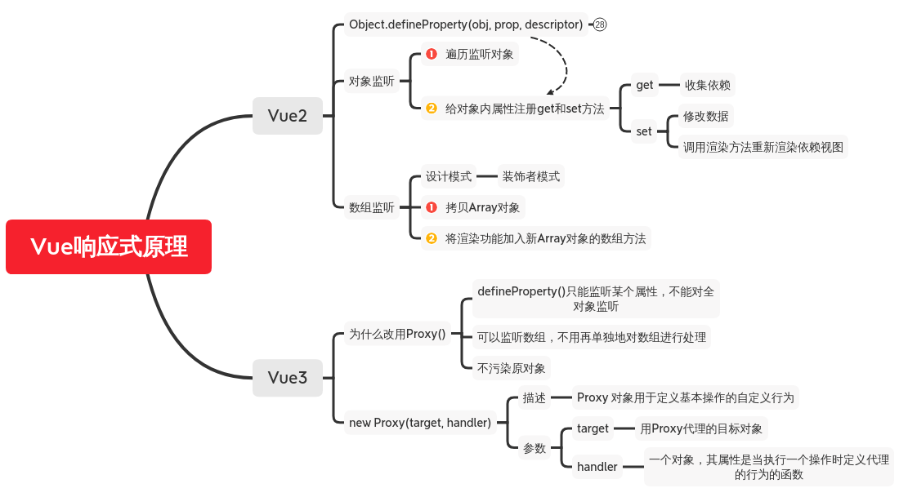
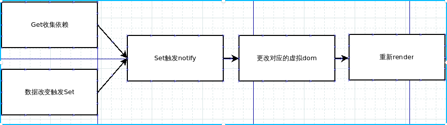

<center><h1 style="color:#41b883"}>Vue响应式原理简介</h1></center>

* 思维导图


<!---->


* 简介
  ><u>改变数据时重新渲染</u>
  * <mark>Vue2原理简介</mark>  
    1. 首先了解一下<a href="https://developer.mozilla.org/zh-CN/docs/Web/JavaScript/Reference/Global_Objects/Object/defineProperty" target="_self">Object.defineProperty(obj,prop,descriptor)</a>  
      使用该API给对象属性增加存取方法(set/get),类似于监听器,监听存取事件并调用相应方法  
    2. 简单实现(对象响应)
        * 创建vue构造器
        ``````javascript
        //vue实例构造器
        function vue () {
          this.$data = {
            a: 1,
            b: {
              c: 1
            }
          }
          this.el = document.getElementById('app')
          this.virtualdom = ""  //虚拟dom
          this.observer(this.$data) //响应式实现方法
          this.render() //dom渲染方法
        }
        ``````
        * render()
        ``````javascript
        //dom渲染方法
        vue.prototype.render = function() {
          this.virtualdom = "I am" + this.$data.a
            this.el.innerHTML = this.virtualdom
        }
        ``````
        * <mark>observer()</mark>
        >去遍历要响应对象的每一个属性，为每一个属性注册get和set方法,并用一个value储存属性值。

        >每当重新赋值值就会调用set方法修改value的值,然后set方法调用渲染方法重新渲染视图。
        ``````javascript
        //注册get和set
        vue.prototype.observer = function(obj) {
          //this->vue
          let self = this
          for(let key in obj) {
            let value
            value = obj[key]
            if(typeof value === 'object') {
              this.observer(value)
            }else {
              Object.defineProperty(obj,key,{
                get() {
                  //dep.depend()
                  //依赖收集(收集用到该数据的组件存入dep)
                  return value
                },
                set(newvalue) {
                  value = newvalue
                  //更新依赖视图
                  self.render() //dep.notify()
                }
              })
            }
          }
        }
        ``````

        ><u>关于get方法的依赖收集</u>：如果每次改变一个数值都对整个视图进行重新渲染会极大地浪费性能，因此，使用get方法去收集依赖该属性的组件,重新渲染的时候只渲染这些组件的视图。（Vue中使用<code>dep.depend()</code>去收集依赖储存在dep中，然后调用<code>dep.notify()</code>去重新渲染dep中的组件)

        ><u>关于使用value来储存属性值</u>：如果用get或set方法去操作原属性值，会一直触发get方法导致报错

        * 流程图

        

    2. 简单实现(数组响应)

    >由于Object.defineProperty(obj,prop,descriptor)无法对数组处理，所以，数组采用其他方法。

    >思路一样，改变数据时重新进行渲染。数组数据的改变分为使用下标直接修改和调用数组方法修改(如push,pop,shift)，Vue考虑了性能问题所以只对使用数组方法修改增加了响应功能。  

    ><u>为数组方法添加渲染功能</u>：利用数组对象的原型新建一个数组对象，遍历需要修改的数组方法并更改，同时调用原数组方法和渲染方法。之后利用这个新数组对象就能产生响应式效果。

      ``````javascript
      let arraypro = Array.prototype
      let arrob = Object.create(arraypro)
      let arr = ['push','pop','shift']
      arr.forEach(function(method,index) {
        arrob[method] = function () {
          let ret = arraypro[methid].apply(this,arguments)
          dep.notify()
        }
      })
      ``````

  * Vue3原理简介

    >依旧是改变数据时重新渲染，只不过使用了新的API  <a href="https://developer.mozilla.org/zh-CN/docs/Web/JavaScript/Reference/Global_Objects/Proxy" target="_self">Proxy</a>

    * observer()

    ``````javascript
    vue.prototype.observer = function(obj) {
      let self = this
      this.$data = new Proxy(obj , {
        get: function(target, key) {
          return target[key]
        },
        set: function(target, key, newvalue) {
          target[key] = newvalue
          self.render()
        }
      })
    }
    ``````

    >注意：Proxy只进行了一层代理，深层对象的代理还需自己实现

