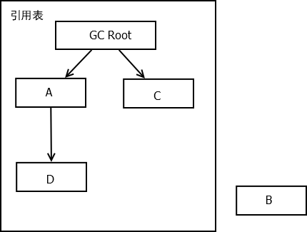
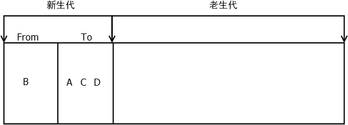
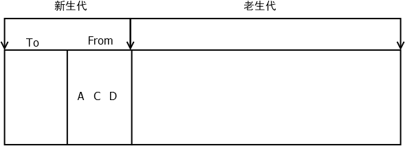
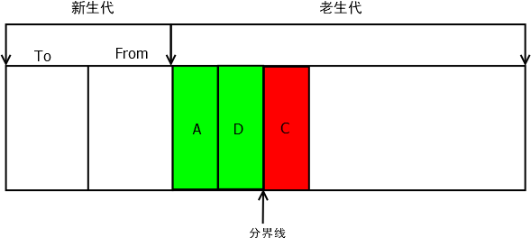
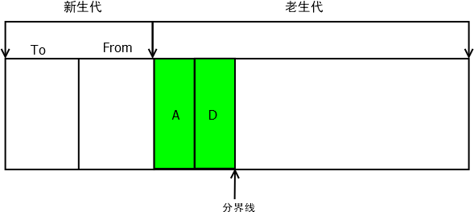

# V8 垃圾收集

## V8内存管理

### 内存管理限制

- 64位操作系统可以使用1.4G内存
- 32位操作系统可以使用0.7G内存

#### 为什么限制内存大小

- V8垃圾收集1.4G内存完全收集一次需要1s以上
- 收集的事件称为 `Stop The World` ,在这个期间，应用的性能和响应能力都会下降

#### 如何打开内存限制

- 一旦初始化成功，生效后不能再修改
- --max-new-space-size, 最大 `new space` 大小，执行 `scavenge` 回收
- --max-old-space-size, 最大 `old space` 大小， 执行 `MarkSweep` 

> node --max-old-space-size=2000 xx.js 单位是M
>
> node --max-new-space-size=1024 xx.js 单位是kb

## V8垃圾回收机制

- V8是基于分代的垃圾回收
- 不同代垃圾回收机制也不一样
- 按存活的时间分为新生代和老生代

### 分代

- 年龄做小的是新生代，由From区域和To区域两个区域组成
  - 在64位系统里，新生代内存是32M，From区域和To区域各占用16M
  - 在32位系统里，新生代内存是16M，From区域和To区域各占用8M
- 年龄大的是老生代
  - 64位系统下老生代内存是1400M
  - 32位系统下老生代内存是700M

### 引用计数

- 语言引擎有一张引用表，保存了内存里面所有的资源的引用次数
- 如果一个值的引用次数是0，就可以释放这块内存

### 新生代垃圾回收

- 新生代对半分为两个区域，一个使用一个空闲

#### 收集流程

- 开始垃圾回收的时候，会检查(检查引用表) `FROM` 区域中的存活对象，如果还存活，拷贝到 `TO` 区域，完成后释放 `FROM` 区域
- 完成后 `FROM` 和 `TO` 互换

------

- 当一个对象经历过多次的垃圾回收依然存活的时候，生命周期比较长的对象会被移动到老生代，这个移动过程称为晋升或升级
  - 经过5次以上的回收还存在
  - TO 的空间使用占比超过25%，或者超大对象

### 老生代垃圾回收

- mark-sweep(标记清除) mark-compact(标记整理) 大多数时候使用标记清除，空间不足以存放对象时使用标记整理
- 老生代空间大，GC耗时较长
- 在GC期间无法响应， stop-the-world
- V8优化方案：增量处理(increment-GC)，把大的暂停时间分割成小的暂停时间

#### 收集流程

- mark-sweep(标记清除 <mark>快</mark> )[会造成内存碎片]
  - 标记存活的对象
  - 标记完成后清理未标记的对象
- mark-compact(标记整理 <mark>慢</mark> )[解决内存碎片问题]
  - 标记存活的对象
  - 标记完成后将活着的对象移动到内存的一侧，移动完成后清除另一侧的内存
- incremental marking(增量标记)[分段整理不一次性整理完]

|   回收算法   | Mark-Sweep | Mark-Compact | Scavenge |
| :----------: | :--------: | :----------: | :------: |
|     速度     |    中等    |     最慢     |   最快   |
|   空间开销   |     少     |      少      | 双倍空间 |
| 是否移动对象 |     否     |      是      |    是    |

## 总结归纳

V8是基于分代的垃圾回收，按存活的时间分为新生代和老生代，不同代垃圾回收机制也不一样。

V8将占用内存分为一小一大，小的为新生代区域，大的为老生代区域。新生代区域又被均分为 `From` 和 `To` 区域，新创建的对象会进入From区域

新生代的垃圾回收是 `引用计数` ，会去检查引用表，将引用到的对象复制到 `To` 区域 

然后释放 `From` 区域内存，再互换 `From` 和 `To` 区域(改个名)

**经过一段时间新生代的垃圾收集还留在内存中的对象** 或者 **To的使用超过25%** 或者 **超大对象** 会晋升为老生代，转移到老生代区域

老生代使用 `mark-sweep(标记清除)` 和 `mark-compact(标记整理)` 两种方案

`标记清除法` 标记存活对象，之后再将没有标记的对象清除

由于 `标记清除法` 会在内存中留下碎片因此还会使用 `标记整理法` ，将存活对象移到内存一侧，再清除分界线另一侧的内存达到整合内存碎片的目的

由于 `标记整理法` 会移动存储位置因此性能上更差一点，正常情况下使用 `标记回收法` 回收，当内存大小不足的时候会使用 `标记整理法` 整理内存碎片

由于老生代区域很大每次收集消耗的时间很长，在这段时间内(stop-the-world)浏览器无法响应，V8还对清除做了优化叫 `增量标记法` 将一次回收的过程分解成多次，分解无法响应的时间