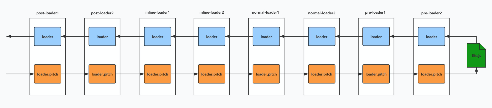

# Webpack

## webpack 编译流程

- 初始化参数：从配置文件和`Shell`语句中读取与合并参数，得出最终的参数
- 开始编译：用上一步得到的参数初始化`Compiler`对象，加载所有配置的插件，执行对象的`run`方法开始执行编译； 确定入口：根据配置中的`entry`找出所有的入口文件
- 编译模块：从入口文件出发，调用所有配置的`Loader`对模块进行编译，再找出该模块依赖的模块，再递归本步骤直到所有入口依赖的文件都经过了本步骤的处理
- 完成模块编译：在经过第 4 步使用`Loader`翻译完所有模块后，得到了每个模块被翻译后的最终内容以及它们之间的依赖关系
- 输出资源：根据入口和模块之间的依赖关系，组装成一个个包含多个模块的 `Chunk`，再把每个`Chunk`转换成一个单独的文件加入到输出列表，这步是可以修改输出内容的最后机会
- 输出完成：在确定好输出内容后，根据配置确定输出的路径和文件名，把文件内容写入到文件系统

### 插件机制

- webpack 在其内部对象上创建各种钩子
- 插件将自己的方法注册到对应钩子上，交给webpack
- webpack 编译过程中，会适时地触发相应钩子

### 如何调用Loader

- **编译模块** 过程中，每读取一个模块调用rules规则匹配loader

- 将匹配成功的 loader 根据参数 `enforce` 收集为四个loader数组 `preLoaders` `normalLoaders` `inlineLoaders` `postLoaders` 

- 整理匹配成功的loader

  ```js
  let loaders = [...poseLoaders, ...inlineLoaders, ...norLoaders, ...preLoaders]
  ```

- 调用 `loader-runner` 库中的 `runLoaders` 运行 loader 编译模块

  >  `loader-runner` 执行过程

  - 根据文件资源路径和 `loaders` 构造loader执行时的上下文 `loaderContext`  ， `loaders` 被map成loader对象数组
  - 迭代加载loaders执行loader pitch（pitch 出现return则直接开始执行上一个loader的normal
  - 所有loader的pitch执行完成加载文件
  - 逆序执行loaders

  

## sourcemap

- sourcemap是为了解决开发代码与实际运行代码不一致不方便debug的问题，sourcemap帮助我们debug到原始开发（未经压缩合并）的代码
- webpack通过配置可以自动给我们 `source maps` 文件， `map` 文件是一种对应编译文件和源文件的方法

- mappings

  | 位置   | 含义                                      |
  | ------ | ----------------------------------------- |
  | 第一位 | 表示这个位置在（转换后代码的）第几列      |
  | 第二位 | 表示这个位置属于sources属性中的哪一个文件 |
  | 第三位 | 表示这个位置属于转换前代码的第几行        |
  | 第四位 | 表示这个位置属于转换前代码的第几列        |
  | 第五位 | 表示这个位置属于names属性中的哪一个变量   |

  > 所有的值都是以0作为基数。第五位不是必须的，如果该位置没有对应names属性中的变量，可以省略第五位。每一位都采用VLQ编码表示；由于VLQ编码是变长的，所以每一位可以由多个字符构成。

  > 如果某个位置是AAAAA，由于A在VLQ编码中表示0，因此这个位置的五个位都是0。它的意思是，该位置在转换后代码的第0列，对应sources属性中第0个文件，属于转换前代码的第0行第0列，对应names属性中的第0个变量。

  - VLQ编码

    1. 将137改写成二进制形式 10001001

       `let binary = (137).toString(2);`

    2. 七位一组做分组，不足的补0 `0000001 0001001`

       `let padded = binary.padStart(Math.ceil(binary.length/7)*7, '0');`

    3. 最后一组开头补0，其余补1 `10000001 00001001`

       `let groups = padded.match(/\d{7}/g);`

       `groups = groups.map((item, index) => (index === groups.length - 1 ? '0' : '1') + item);`

        `let vlqCode = groups.join('');`

  - Base64 VLQ


## Plugin

| 插件名称                       | 插件描述                                                     |
| ------------------------------ | ------------------------------------------------------------ |
| html-webpack-plugin            | 根据模板生产html的插件                                       |
| webpack.SourceMapDevToolPlugin | webpack内置的精确控制sourcemap的插件                         |
| filemanager-webpack-plugin     | 文件管理插件，在打包前后操作文件（copy、move、delete、mkdir、archive[打包压缩]） |
| Tree-shaking                   | 移除没有用到的导入内容，支持es module 静态依赖分析，动态的require不支持 |
|                                |                                                              |

### Compiler 和 Compilation

- Compiler 对象代表了完整的 webpack 环境配置。这个对象在启动 webpack 时被一次性创建，并配置好所有可操作的设置，包括 options， loader 和 plugin。当在 webpack 环境中应用一个插件时，插件将收到此 compiler 对象的引用。可以使用它来访问 webpack 的主环境。
- Compilation 对象代表了一次资源版本构建。当运行 webpack 开发环境中间件时，每当检测到一个文件变化，就会创建一个新的 Compilation，从而生产一组新的编译资源。一个 Compilation 对象表现了当前的模块资源、编译生成资源、变化的文件、以及被跟踪依赖的状态信息。Compilation 对象也提供了很多关键时机的回调，以供插件做自定义处理时选择使用。

### 插件的实现

- webpack本质是一个事件流机制，核心模块：tapable(Sync + Async)Hooks 构造出 === Compiler(编译) + Compilation(创建bundles)

- 创建一个插件函数，在其prototype上定义apply方法，指定一个webpack自身的事件钩子

  ```js
  class HashPlugin {
    // 定义apply方法
    apply(compiler) {
      // 为 compiler 的 compilation 事件注册回调函数
      compiler.hooks.compilation.tap('HashPlugin', (compilation) => {
        // 为 compilation 的 afterHash 事件注册回调函数
        compilation.hooks.afterHash.tap('HashPlugin', () => {
          compilation.hash = 'hash';
        });
      });
    }
  }
  ```

- 函数内部处理webpack内部实例的特定数据

- 处理完成后，调用webpack提供的回调函数

## loader

> loader 是一个导出为函数的 `JavaScript` 模块。它接收上一个loader产生的结果或者资源文件作为入参。也可以用多个loader 函数组成 loader chain 

> compiler 需要得到最后一个loader产生的处理结果。这个处理结果应该是 String 或者 Buffer

## Loader和Plugin的区别

1. 作用不同
   - Loader直译为"加载器"。Webpack将一切文件视为模块，但是webpack原生是只能解析js文件，如果想将其他文件也打包的话，就会用到loader。 所以Loader的作用是 **让webpack拥有加载和解析非JavaScript文件的能力** 。
   - Plugin直译为"插件"。Plugin可以 **扩展webpack的功能，让webpack具有更多的灵活性** 。 在 Webpack 运行的生命周期中会广播出许多事件，Plugin 可以监听这些事件，在合适的时机通过 Webpack 提供的 API 改变输出结果。
2. 用法不同
   - Loader在module.rules中配置，也就是说作为模块的解析规则而存在。 类型为数组，每一项都是一个Object，里面描述了对于什么类型的文件（test），使用什么加载(loader)和使用的参数（options）
   - Plugin在plugins中单独配置。 类型为数组，每一项是一个plugin的实例，参数都通过构造函数传入