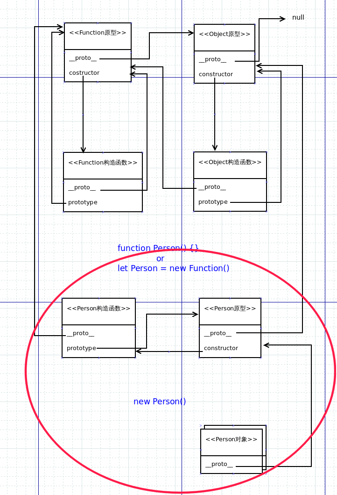
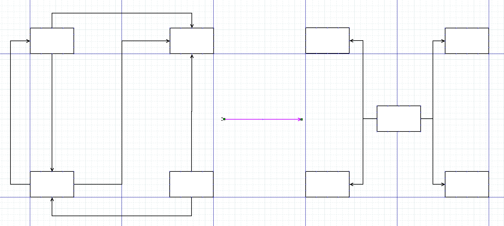

## 零.六大原则

- 开闭原则

  - 原则思想： 一个软件实体应当对扩展开放，对修改关闭。即软件实体应尽量在不修改原有代码的情况下进行扩展

  >软件实体可以指一个软件模块、一个由多个类组成的局部结构或一个独立的类

  - 描述：  任何软件都需要面临一个很重要的问题，即它们的需求会随时间的推移而发生变化。当软件系统需要面对新的需求时，我们应该尽量保证系统的设计框架是稳定的，通过扩展解决需求能保证架构稳定

  - 优点：使程序的扩展性好，易于维护和升级

- 单一职责原则

  - 原则思想： 一个类只负责一个功能领域中的相应职责，或者可以定义为：就一个类而言，应该只有一个引起它变化的原因

  - 描述：如果一个类承担的职责过多，就等于把这些职责耦合在一起，一个职责的变化可能会削弱或者抑制这个类完成其他职责的能力。这种耦合会导致脆弱的设计，当变化发生时，设计会遭受到意想不到的破坏

  - 优点：降低类和类的耦合，提高可读性，增加可维护性和可拓展性，降低可变性的风险

- 里氏替换原则

  - 原则思想：使用的基类可以在任何地方使用继承的子类，完美的替换基类

  >如果对每一个类型为S的对象o1，都有类型为T的对象o2，使得以T定义的所有程序P在所有的对象o1代换o2时，程序P的行为没有变化，那么类型S是类型T的子类型

  - 描述：在软件中将一个基类对象替换成它的子类对象，程序将不会产生任何错误和异常，反过来则不成立，如果一个软件实体使用的是一个子类对象的话，那么它不一定能够使用基类对象

  - 优点：增加程序的健壮性，即使增加了子类，原有的子类还可以继续运行，互不影响

- 依赖倒置原则

  - 原则思想：抽象不应该依赖于细节，细节应当依赖于抽象。换言之，要针对接口编程，而不是针对实现编程

  - 描述：依赖倒转原则要求我们在程序代码中传递参数时或在关联关系中，尽量引用层次高的抽象层类，即使用接口和抽象类进行变量类型声明、参数类型声明、方法返回类型声明，以及数据类型的转换等，而不要用具体类来做这些事情

  - 优点：在引入抽象层后，系统将具有很好的灵活性，可以减少需求变化带来的工作量

- 接口隔离原则

  - 原则思想：使用多个专门的接口，而不使用单一的总接口，即客户端不应该依赖那些它不需要的接口

  - 描述：每一个接口应该承担一种相对独立的角色，不干不该干的事，该干的事都要干，不然依赖该接口的类就需要实现他们不需要的方法

  - 优点：降低类之间的耦合度

- 迪米特法则（最少知道原则）

  - 原则思想：一个软件实体应当尽可能少地与其他实体发生相互作用

  - 描述：一个类尽量减少自己对其他对象的依赖，原则是低耦合，高内聚，只有使各个模块之间的耦合尽量的低，才能提高代码的复用率

  - 优点：低耦合，高内聚

## 一.构造器模式

### 动机： 快速构造对象并赋予属性及方法

### JS构造对象和赋予属性的方法

- 构造方法1

``````javascript
let object = {}
``````

- 构造方法2

``````javascript
let object = Object.create( Object.prototype )
``````

- 构造方法3

``````javascript
let object = new Object()
``````

-----

- 赋予方法1

``````javascript
object.name = "R"
``````

- 赋予方法2

``````javascript
object['name'] = "R"
``````

- 赋予方法3

``````javascript
Object.defineProperty( object, "name", {
  value: "R",
  writable: true,
  enumerable: true,
  configurable: true
} )
``````

- 赋予方法4

``````javascript
Object.definePropertys( object, {
    "name": {
      value: "R",
      writable: true,
      enumerable: true,
      configurable: true
    },
    "age": {
      value: "1",
      writable: true,
      enumerable: true,
      configurable: true
    },
} )
``````
***每次构造对象都要不断地去赋予属性，特别是在构造的对象具有相同属性不同属性值的时候显得很麻烦***

>例如

``````javascript
let person1 = new Object()
person1.name = "R"
person1.age = "18"
person1.say = function() {
  console.log( `I am ${ this.name }, I am ${ this.age } years old` )
}

let person1 = new Object()
person1.name = "R"
person1.age = "18"
person1.say = function() {
  console.log( `I am ${ this.name }, I am ${ this.age } years old` )
}
``````

### 使用构造器

- 基本使用方法

``````javascript
function Person( name, age ) {

  this.name = name
  this.age = age

  this.say = function() {
    console.log( `I am ${ this.name }, I am ${ this.age } years old` )
  }
}

let person1 = new Person( "R", 18 )
person1.say() // I am R, I am 18 years old
let person2 = new Person( "Q", 19 )
person2.say() // I am Q, I am 19 years old
``````

>这样就简单便捷多了,构造的数量越多越明显

***但是存在一个问题，在构造对象时每个对象内部都创建了相同的`say`方法,会浪费内存空间***

- 利用原型

>每个`function`在创建后都有一个原型对象，可以通过例如`Person.prototype`找到他，`new Person()`实际上就是先在该原型下建了一个空对象，将`Person`方法的`this`指向该空对象后执行方法

>通过Person构造器构造出来的对象都可以访问到Person原型中的方法和属性



``````javascript
function Person( name, age ) {

  this.name = name
  this.age = age

 }

//将方法绑定到原型上
Person.prototype.say = function() {
    console.log( `I am ${ this.name }, I am ${ this.age } years old` )
}


let person1 = new Person( "R", 18 )
person1.say() // I am R, I am 18 years old
let person2 = new Person( "Q", 19 )
person2.say() // I am Q, I am 19 years old

//简单验证是否为同一个方法
console.log( person1.say === person2.say ) //true
``````

>这样每个实例对象调用的都是原型中的方法

## 二.模块模式

### 定义：类提供私有和公共封装的方法

### 动机：

**为了使我们能够在单个对象内包含公共/私有方法和变量，从而使特定部分不受全局范围的影响。这样可以减少我们的函数名与页面上其他脚本中定义的其他函数发生冲突的可能性**

### 优缺点：

- 优点：

  1. 支持私有数据-因此，在模块模式下，我们代码的公共部分可以触摸私有部分，但是外界无法触摸类的私有部分

- 缺点：

  1. 由于我们以不同的方式访问公共和私有成员，因此当我们希望更改可见性时，实际上我们必须对使用该成员的每个位置进行更改

  2. 无法在稍后添加到对象的方法中访问私有成员

  3. 需要修补程序的错误时更加复杂

### 构建思路：使用闭包创建私有变量及方法，返回公共API

### 构建示例：

- 示例1

``````javascript
let Module = (function() {

  let counter = 0

  return {
    incrementCounter: function() {
      return counter++
    },
    resetCounter: function() {
      counter = 0
    }
  }
})()

//最后Module的样子
/*
*Module = {
*  incrementCounter: function() {
*    return counter++
*  },
*  resetCounter: function() {
*    counter = 0
*  }
*}
*/

console.log(Module.incrementCounter()) //0
console.log(Module.incrementCounter()) //1

Module.resetCounter()

console.log(Module.incrementCounter()) //0
``````

>在这里我们构造了一个`Module`模块，代码的其他地方无法直接读取`incrementCounter`和`resetCounter`,只能通过`Module`模块访问

>`Module`内部没有`counter`因此你不可能访问到`counter`,只有`Module`暴露出来的两个API能访问`counter`,`counter`就像私有变量一样，两个方法则为公共API

- 示例2

``````javascript
let Module = (function() {

  //私有变量
  let counter = 0

  let person = new Person()

  //暴露方法
  person.incrementCounter = function() {
    return counter++
  }

  //暴露方法
  person.resetCounter = function() {
    counter = 0
  }

  return person
})()
``````

>这种形式可以解决返回值必须是某种类型对象的问题

- 示例3

``````javascript
let Module = (function() {

  let counter = 0

  incrementCounter: function() {
    return counter++
  }

  resetCounter: function() {
    counter = 0
  }

  return {
    increment: incrementCounter,
    reset: resetCounter
  }
})()
``````

>这种称为**显示模块模式**,这种模式可以使脚本的语法更加一致。它还使在模块末尾可以更清楚地知道我们的哪些函数和变量可以公开访问，从而简化了可读性

>缺点是如果内部使用了公共属性或方法，容易会发生覆盖的情况

## 三.单例模式

### 定义: 保证一个类仅有一个实例，并提供一个访问它的全局访问点

### 动机：

**对于系统中的某些类来说，只有一个实例很重要，例如，一个系统中可以存在多个打印任务，但是只能有一个正在工作的任务；一个系统只能有一个窗口管理器或文件系统；一个系统只能有一个计时工具或ID(序号)生成器。如在Windows中就只能打开一个任务管理器。如果不使用机制对窗口对象进行唯一化，将弹出多个窗口，如果这些窗口显示的内容完全一致，则是重复对象，浪费内存资源；如果这些窗口显示的内容不一致，则意味着在某一瞬间系统有多个状态，与实际不符，也会给用户带来误解，不知道哪一个才是真实的状态。因此有时确保系统中某个对象的唯一性即一个类只能有一个实例非常重要。**

### 优缺点:

  * 优点：

    1. 单例模式会阻止其他对象实例化其自己的单例对象的副本，从而确保所有对象都访问唯一实例

    2. 因为类控制了实例化过程，所以类可以灵活更改实例化过程

    3. 在内存里只有一个实例，减少了内存的开销

    4. 避免对资源的多重占用

  * 缺点：

    1. 虽然数量很少，但如果每次对象请求引用时都要检查是否存在类的实例，将仍然需要一些开销(可以通过使用静态初始化解决此问题)

### 构建思路：使用该单例对象时判断系统是否已经有这个单例对象，如果有就返回，如果没有就构造

### 构建示例：

* 示例1

>私有构造函数（避免直接访问构造函数来构造实例）

``````js
let SingletonInterface = (function () {
  //私有构造器
  function Singleton() {
    this.meg = "Hello!"
  }

  //实例容器
  let instance

  //暴露出一个访问点
  return {
    getInstance: function() {
      if(instance === undefined) {
        instance = new Singleton()
      }
      return instance
    }
  }
})()

let singleton = SingletonInterface.getInstance()
console.log(singleton.meg) // Hello!
let singleton2 = SingletonInterface.getInstance()
console.log(singleton === singleton2) // true
``````

* 示例2

>构造器内部判断（若实例存在则停止构造返回实例，若不存在则继续构造）

``````js
function Singleton() {
  //判断是否存在实例
  if(typeof Singleton.instance === 'object') {
    return Singleton.instance
  }

  this.msg = "Hello!"

  //实例容器
   Singleton.instance = this
}

let singleton = new Singleton()
console.log(singleton.msg) // Hello!
let singleton2 = new Singleton()
console.log(singleton === singleton2) // true
``````

* 示例3

>重写构造函数（第一次构建实例时重写构造函数，功能为直接返回实例）

``````js
function Singleton() {
  //实例容器
  let instance = this

  this.msg = "Hello!"

  //重写构造函数
  Singleton = function () {
    return instance
  }
}
let singleton = new Singleton()
console.log(singleton.msg) // Hello!
let singleton2 = new Singleton()
console.log(singleton === singleton2) // true
``````

## 四.观察者模式

### 定义：一个目标对象管理所有相依于它的观察者对象，并且在它本身的状态改变时主动发出通知

>一个或多个观察者对主题的状态感兴趣，并通过附加自己的身份向主题注册。当我们的主题有所变化时，将发送一条通知消息告知注册的观察者。当观察者不再对主题的状态感兴趣时，他们可以取消注册

### 动机: 为了使得当一个对象的状态发生改变时，所有依赖于它的对象都得到通知并被自动更新。在不使类紧密耦合的情况下保持相关对象之间的一致性

### 优缺点：

- 优点：

  1. 观察者和被观察者是抽象耦合的

  2. 建立一套触发机制

- 缺点：

  1. 如果一个被观察者对象有很多的直接和间接的观察者的话，将所有的观察者都通知到会花费很多时间(js同步问题)

  2. 如果在观察者和观察目标之间有循环依赖的话，观察目标会触发它们之间进行循环调用，可能导致系统崩溃

  3. 观察者模式没有相应的机制让观察者知道所观察的目标对象是怎么发生变化的，而仅仅只是知道观察目标发生了变化

### 构建示例

- 首先我们需要一张观察者列表，该列表具有各种方法(注册、取消注册、统计、获取观察者)

``````javascript
//观察者列表构造函数
function ObserverList() {
  this.observerList = []
}

//注册方法
ObserverList.prototype.add = function( obj ) {
  return this.observerList.push( obj )
}

//统计方法
ObserverList.prototype.count = function() {
  return this.observerList.length
}

//获取观察者的方法
ObserverList.prototype.get = function( index ) {
  if( index > -1 && index < this.observerList.length ) {
    return this.observerList[ index ]
  }
}

//取消注册的方法
//获取观察者在注册表的位置
ObserverList.prototype.indexOf = function( obj, startIndex ) {
  let i = startIndex

  while( i < this.observerList.length ) {
    if( this.observerList[i] === ogj ) {
      return i
    }
    i++
  }
  return -1
}
//删除观察者
ObserverList.prototype.remove = function( index ) {
  this.observerList.splice( index, 1 )
}
``````

- 接下来建立主题，主题拥有列表，并具有在列表上添加删除观察者，和向观察者发起通知的能力

``````javascript
//主题构造函数
function Subject() {
  this.observers = new ObserverList()
}

//向列表添加观察者的方法
Subject.prototype.addObserver = function( observer ) {
  this.observers.add( observer )
}

//移除列表中的观察者的方法
Subject.prototype.removeObserver =function( observer ) {
  this.observers.removeAt( this.observers.indexOf( observer, 0 ) )
}

//向观察者发起通知的方法
Subject.prototype.notify = function( context ) {
  //统计观察者数量
  let observerCount = this.observers.count()
  for( let i = 0; i < observerCount; i++ ) {
    //让每个观察者调用更新方法
    this.observers.get(i).updata( context )
  }
}
``````

- 最后是拥有自己更新方法的观察者

``````javascript
//观察者构造函数
function Observer() {
  //这里模拟具有不同更新方法的不同类型对象
  this.updata = function() {
    //updata
  }
}
``````

### 变体 发布/订阅模式

>发布/订阅模式不是发布者直接调用其他对象的方法，而是订阅者订阅发布者的特定任务或活动,在事件发生时执行这些任务(js事件回调)

``````javascript
let pubsub = {}

;(function(obj) {
  //存放订阅
  /*
   *  {
   *    event1: [ { token: token, func: func } ],
   *    event2: [ { token: token, func: func } ]
   *  }
   */
  let topics = {}

  let subUid = -1

  //发布方法
  obj.publish = function( topic, args ) {
    if( !topics[ topic ] ) {//该事件没有订阅者
      return false
    }

    const subscribers = topics[ topic ]
    let len = subscribers ? subscribers.length : 0

    while(len--) {
      subscribers[len].func( topic, args )
    }

    return this
  }

  //订阅方法
  obj.subscribe = function( topic, func ) {
    if( !topics[topic] ) {
      topics[topic] = []
    }

    let token = ( ++subUid ).toString()
    topics[ topic ].push({
      token: token,
      func: func
    })

    return token
  }

  //取消订阅方法
  obj.unsubscribe = function( token ) {
    for( let m in topics ) {
      if( topics[m] ) {
        for( let i = 0, j = topics[m].length; i < j; i++ ) {
          if( topics[m][i].token === token ) {
            topics[m].splice( i, 1 )
            return token
          }
        }
      }
    }
    return this
  }

})( pubsub )


//使用

let messageLogger = function( topics, data ) {
  console.log( `Logging: ${ topics } : ${ data }` )
}

//订阅事件
let subscription =pubsub.subscribe( "log", messageLogger )

//发布事件
pubsub.publish( "log", "hello world!" )

//取消订阅
pubsub.unsubscribe( subscription )

pubsub.publish( "log", "hello world!" )
``````

## 五.中介者模式

### 定义：定义一个中介对象来封装一系列对象之间的交互,使原有对象之间的耦合松散,且可以独立地改变它们之间的交互

### 动机：为了解决对象与对象之间存在大量的关联关系



### 优缺点：

- 优点：

  1. 降低了类的复杂度，将一对多转化成了一对一

  2. 各个类之间的解耦

- 缺点：中介者会庞大，变得复杂难以维护

### 构建示例

>举个交流软件示例，未使用中介者模式前每个用户发送信息后都要自己向其他用户的窗体中添加信息，使用中介者模式后统一交给中介者添加

- 原始实例

``````javascript
//用户
function User( name ) {
  this.name = name
  this.wind = []
  this.send = ""
}

//窗口显示
User.prototype.pushMessage = function( user, msg ) {
  user.wind.push( msg )
}

//发送消息
User.prototype.sendMessage = function( msg ) {
  this.send = msg
}

let user1 = new User("R")
let user2 = new User("Q")
let user3 = new User("X")

user1.sendMessage("hello")
console.log(user1.wind) //[]
console.log(user2.wind) //[]
console.log(user3.wind) //[]
user1.pushMessage( user1, user1.send )
user1.pushMessage( user2, user1.send )
user1.pushMessage( user3, user1.send )
console.log(user1.wind) //[ "hello" ]
console.log(user2.wind) //[ "hello" ]
console.log(user3.wind) //[ "hello" ]
``````

- 中介者示例

``````javascript
//用户
function User( name ) {
  this.name = name
  this.wind = []
}

User.prototype.sendMessage = function( msg ) {
  mediator.pushMessage( msg )
}

//中介者
let mediator = {
  users: [],
  pushMessage( msg ) {
    this.users.forEach( user => user.wind.push( msg ) )
  }
}

let user1 = new User("R")
let user2 = new User("Q")
let user3 = new User("X")
mediator.users.push( user1, user2, user3 )

//此后由中介者向各个用户的窗体推送信息
user1.sendMessage( "Hello" )
user2.sendMessage( "Who are you?" )
console.log( user1.wind ) //[ 'hello', 'Who are you?' ]
console.log( user2.wind ) //[ 'hello', 'Who are you?' ]
console.log( user3.wind ) //[ 'hello', 'Who are you?' ]
``````

## 六.原型模式

### 定义：通过克隆基于现有对象的模板创建对象

### 动机：为了创建重复的对象，同时又能保证性能

### 优缺点：

- 优点：

  1. 性能提高

  2. 逃避构造函数的约束

- 缺点：

  1. 配备克隆方法需要对类的功能进行通盘考虑

### 构建示例：

``````javascript
let car = {
  name: "Car",
  drive: function() {
    console.log( "I'm driving!" )
  }
}

//JS原生方法,可提供第二个参数实现差异继承
let yourCar = Object.create( car )

//替代实现
let create = (function() {
  function f() {}
  return function( proto ) {
    f.prototype = proto
    return new f()
  }
})

let yourCar2 = create( car )
``````

## 七.命令模式

### 定义：将一个请求封装成一个对象，从而使您可以用不同的请求对客户进行参数化

### 动机：为了对行为进行记录、撤销或重做、事务等处理

### 优缺点：

- 优点：

  1. 降低对象之间的耦合度

  2. 新的命令可以很容易地加入到系统中

  3. 可以比较容易地设计一个组合命令

- 缺点：

  1. 使用命令模式可能会导致某些系统有过多的具体命令类

### 构建示例：

>一个购买/出售的示例

``````javascript
//产品信息
const ABCStock = (function() {
  let name = "ABC"
  let quantity = 10
  return class {
    buy() {
      console.log(`Stock [ Name: ${ name }, Quantity: ${ quantity } ] bought`)
    }
    sell() {
      console.log(`Stock [ Name: ${ name }, Quantity: ${ quantity } ] sold`)
    }
  }
})()


//购买请求
const BuyStock = (function() {
  let _Stock = null
  return class {
    constructor( Stock ) {
      _Stock = Stock
    }
    execute() {
      _Stock.buy()
    }
  }
})()

//销售请求
const SellStock = (function() {
  let _Stock = null
  return class {
    constructor( Stock ) {
      _Stock = Stock
    }
    execute() {
      _Stock.sell()
    }
  }
})()

//销售经理(请求处理中心)
const Broker = (function() {
  let _orderList = []
  return class {
    //添请求
    takeOrder( order ) {
      _orderList.push( order )
    }
    //处理请求
    placeOrders() {
      for(let order of _orderList) {
        order.execute()
      }
      //清空列表
      _orderList.length = 0
    }
  }
})()

let abcStock = new ABCStock()

let buyStockOrder = new BuyStock( abcStock )
let sellStockOrder = new SellStock( abcStock )

let broker = new Broker()
broker.takeOrder( buyStockOrder )
broker.takeOrder( sellStockOrder )

broker.placeOrders()
``````

## 外观模式

